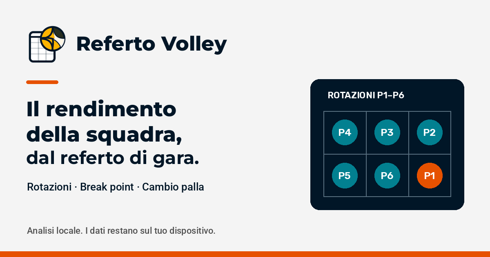

<p align="center"></p>

# Referto Volley

Referto Volley permette di analizzare i dati contenuti nel referto di gara della pallavolo e di osservare il rendimento della squadra nelle diverse rotazioni e nelle fasi break point e cambio palla.

Carica un referto PDF compatibile o compila una gara manualmente, verifica i dati e chi gioca al palleggio, quindi salva la gara. Puoi consultare tabelle e grafici, analizzare più gare della stessa squadra ed esportare un report PDF. Il referto non identifica il fondamentale che ha prodotto ogni punto: i dati non misurano l’efficienza di attacco, ricezione, muro o altri fondamentali.

## Terminologia

| Voce | Significato |
| --- | --- |
| Fase break point (BP) | Fase nella quale la squadra è al servizio. |
| Fase cambio palla (CP) | Fase nella quale la squadra è in ricezione. |
| Punti in fase break point | Punti conquistati dalla squadra mentre è al servizio. |
| Punti subiti in fase cambio palla | Punti conquistati dall’avversario mentre la squadra è in ricezione prima che riconquisti il servizio. |
| P1–P6 | Rotazione identificata dalla posizione del palleggiatore. |
| TT | Turni totali nella fase indicata. |
| MP | Media punti per turno: conquistati in BP, subiti in CP. |
| % punti BP | Quota dei punti in fase break point della rotazione sul totale in fase break point. |
| Differenza MP | MP BP meno MP CP. |

Il punto che riconquista il servizio è conquistato in fase cambio palla e viene escluso dai punti in fase break point. La media degli scambi in ricezione per cambio palla include quel punto ed esclude le fasi terminate a fine set senza riconquistare il servizio.

Nell’analisi di più gare, punti e turni vengono sommati per rotazione e le medie sono calcolate sui totali. Nella tabella degli atleti, i punti nei set di presenza sono il totale dei punti delle due squadre nei set in cui l’atleta risulta coinvolto, non il conteggio dei suoi singoli scambi; i servizi sono stimati dai progressivi. I punti in fase break point sono sempre punti della squadra.

## Dati, privacy e funzionamento locale

L’applicazione è progettata per elaborare i referti localmente nel browser:

- I PDF caricati non vengono inviati a un server per essere analizzati. PDF.js legge i file sul dispositivo; worker e font PDF sono distribuiti con l’applicazione.
- I dati estratti rimangono sul dispositivo dell’utente. Le gare salvate e i PDF sono conservati tramite IndexedDB, nel database `referto-volley`. React gestisce lo stato in memoria; non è il sistema di persistenza.
- L’archivio è associato al browser e al dispositivo utilizzati. Dallo Storico puoi esportare un backup JSON con gare e PDF e ripristinarlo su un altro dispositivo.
- La cancellazione dei dati del sito o del browser può comportare la perdita dell’archivio locale se non hai esportato un backup.

Referto Volley non utilizza cookie di profilazione, analytics o pubblicitari e non utilizza cookie per memorizzare i dati delle gare. L’archivio dell’applicazione viene conservato localmente nel browser tramite IndexedDB. Il codice applicativo non imposta cookie, non usa localStorage o sessionStorage e non integra servizi di analytics, tracking, pubblicità o telemetria.

Font, script, worker e risorse sono inclusi nel progetto: nessun caricamento da Google Fonts o CDN durante l’uso. La versione web deve essere caricata dal sito; i pacchetti Tauri includono il frontend per l’uso locale. Browser e applicazioni native hanno archivi separati: usa il backup JSON per trasferire le gare. Le build e l’installazione delle dipendenze di sviluppo richiedono invece accesso ai registri npm/Cargo e agli SDK delle piattaforme.

## Sviluppo

Dalla radice del repository, con Node.js 22 compatibile con Vite e npm:

```sh
npm ci
npm run dev
```

Comandi disponibili dalla radice:

```sh
npm test
npm run lint
npm run build
npm run preview
```

La build statica viene generata in `webapp/dist`. Il modello delle rotazioni è contenuto in `webapp/src/data/workbook.json`, estratto dal foglio Excel presente nel repository; `webapp/src/formulas.js` ne interpreta le formule. Importazione PDF, analisi e archivio vengono eseguiti nel browser.

## Applicazioni desktop e mobile

Lo stesso frontend è incluso nelle applicazioni [Tauri 2](https://v2.tauri.app/). Configurazione e sorgenti Rust sono in `src-tauri`; non è richiesto un server per analizzare le gare.

```sh
npm run desktop:dev
npm run desktop:build
# Dopo aver installato SDK/NDK Android:
npm run tauri -- android init
npm run android:build
# Su macOS con Xcode:
npm run tauri -- ios init
npm run ios:build
```

Servono Rust e i [prerequisiti della piattaforma](https://v2.tauri.app/start/prerequisites/). Le dipendenze npm e Rust sono bloccate in `package-lock.json` e `src-tauri/Cargo.lock`.

Il workflow [Build applicazioni Tauri](.github/workflows/build-apps.yml) parte a ogni push su `main`, tag `v*`, pull request o avvio manuale. I file si scaricano dagli **Artifacts** dell’esecuzione GitHub Actions; il workflow non pubblica automaticamente negli store.

| Piattaforma | Output |
| --- | --- |
| Windows x64 | Installer `.exe` NSIS e `.msi` |
| macOS Apple Silicon e Intel | `.dmg` separati, firma ad hoc senza notarizzazione |
| Linux x64 | `.deb` e `.AppImage` |
| Android ARM64, ARMv7 e x86_64 | APK debug installabile; APK e AAB release, firmati se sono configurati i secret |
| iPhone/iPad | Build simulatore ARM64 e IPA dispositivo non firmato, in archivi `.tar.gz` |
| iPhone/iPad con credenziali Apple | IPA firmato con avvio manuale e opzione `signed_ios` |

Per firma, installazione e limiti delle build consulta [docs/builds.md](docs/builds.md). Le build mobili e gli installer vanno provati sulle rispettive piattaforme, inclusi importazione PDF, esportazione e ripristino dei backup.

## Social preview e risorse locali



La preview PNG da 1200 × 630 è collegata ai metadati Open Graph e Twitter. Può essere usata anche in **Settings → General → Social preview** del repository GitHub. Il logo è riutilizzato anche per le icone Tauri di tutte le piattaforme.

I font variabili Montserrat, Roboto e Rubik e le rispettive licenze sono in `webapp/public/fonts`. Per rigenerare la preview con Python e Pillow:

```sh
npm run tauri -- icon webapp/public/favicon.svg
python scripts/social-preview.py
```

Il workflow Pages imposta automaticamente l’URL pubblico della preview e il percorso del sito. Per altri hosting imposta `VITE_SITE_URL` (URL pubblico completo) e `VITE_BASE_PATH` (percorso base); vedi `.env.example`. Queste variabili sono configurazioni di build, non servizi esterni.

## Progetto, autori e licenza

Referto Volley è un progetto di Maurizio Napolitano, basato sul modello di analisi delle rotazioni sviluppato da Andrea Fortunati in un foglio di calcolo Excel.

Il credito ad Andrea Fortunati riguarda il modello nel foglio Excel. Importazione PDF, interfaccia, archivio locale e altre funzionalità dell’applicazione sono sviluppi del progetto software.

Il software è distribuito con licenza [WTFPL — Do What The Fuck You Want To Public License, Version 2](LICENSE). Le licenze dei font PDF distribuiti sono conservate separatamente in `webapp/public/standard_fonts` e `webapp/public/fonts`.
