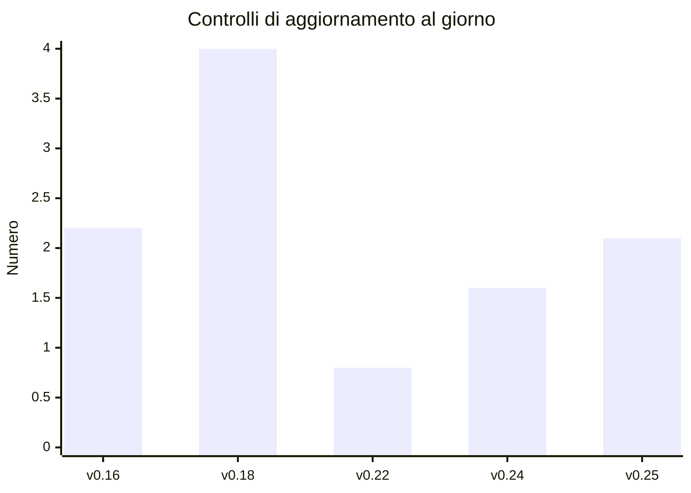
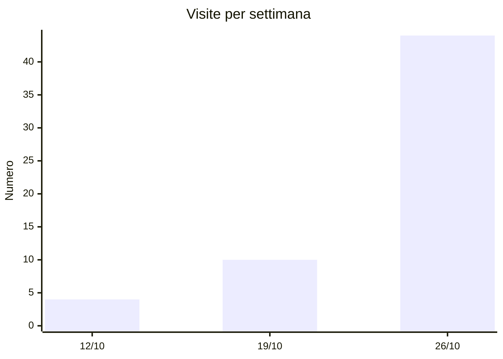

# Statistiche di Referto Volley

Aggiornate il 02/11/2026, ogni lunedì in automatico. I dati vengono da GitHub: l'app non invia nulla. Lo storico è in `github-stats.json`.

## In breve

- **Uso delle app desktop:** 2,1 controlli di aggiornamento al giorno con la v0.25.
- **Visite al repository:** 44 nella settimana del 26/10/2026, contro 10 della precedente.
- **Repository:** 0 stelle, 1 fork.

## Uso delle app, versione per versione

Ogni app desktop legge `latest.json` all'avvio, se il controllo aggiornamenti è attivo: i **controlli** sono avvii, non persone. Conta soprattutto il valore **al giorno**. Non comprendono la versione web e le app Android. Le versioni rimaste le più recenti per meno di un giorno non sono elencate, salvo l'ultima.

| Versione | Uscita | Giorni come ultima | Controlli | Al giorno | Windows | macOS | Linux | Android | iOS |
| --- | --- | --- | --- | --- | --- | --- | --- | --- | --- |
| v0.16 | 28/09/2026 | 1,8 | 4 | 2,2 | 4 | 3 | 3 | 2 | 1 |
| v0.18 | 30/09/2026 | 4,3 | 17 | 4,0 | 11 | 2 | 4 | 7 | 1 |
| v0.22 | 05/10/2026 | 2,4 | 2 | 0,8 | 2 | 3 | 4 | 3 | 1 |
| v0.24 | 07/10/2026 | 16,2 | 26 | 1,6 | 12 | 3 | 5 | 5 | 1 |
| v0.25 | 23/10/2026 | 8,0 | 17 | 2,1 | 14 | 6 | 5 | 5 | 6 |
| v0.32 | 01/11/2026 | 0,6 | 2 | – | 3 | 2 | 3 | 2 | 1 |

Le colonne per piattaforma sono i download dei pacchetti di installazione. Anche una versione appena uscita ne ha qualcuno per piattaforma, per prove o bot: conta ciò che supera quella soglia.

```mermaid
xychart-beta
  title "Controlli di aggiornamento al giorno"
  x-axis ["v0.16", "v0.18", "v0.22", "v0.24", "v0.25"]
  y-axis "Numero" 0 --> 4
  bar [2.2, 4, 0.8, 1.6, 2.1]
```

## Visite al repository

```mermaid
xychart-beta
  title "Visite per settimana"
  x-axis ["12/10", "19/10", "26/10"]
  y-axis "Numero" 0 --> 44
  bar [4, 10, 44]
```

| Settimana dal | Visite | Persone* |
| --- | --- | --- |
| 12/10/2026 | 4 | 3 |
| 19/10/2026 | 10 | 9 |
| 26/10/2026 | 44 | 16 |

\* Somma delle persone diverse di ogni giorno: chi torna in due giorni conta due volte.

## Da dove arrivano
Ultimi 14 giorni.

| Provenienza | Visite | Persone |
| --- | --- | --- |
| napo.github.io | 3 | 2 |
| github.com | 2 | 2 |

## Pagine più viste
Ultimi 14 giorni.

| Pagina | Visite | Persone |
| --- | --- | --- |
| `/` | 18 | 7 |
| `/releases` | 16 | 10 |
| `/tree/stats` | 6 | 2 |
| `/compare/v0.23...v0.24` | 2 | 2 |
| `/releases/tag/v0.25` | 2 | 2 |

## Clonazioni

Copie del codice: 223 in 3 settimane. Sono in gran parte automatismi, quindi non indicano quante persone usano l'app.

